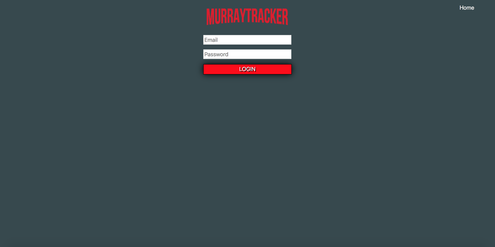

# MurrayTracker

#### By Brandon 'Bools' Fiebiger, Kurt ‘Curious Console Log' Miller, and Jesse Mcfadden

### Project

MurrayTracker is a graphical interface for the Movie-Tracker database displaying all of Bill Murray's fine work. This web application was built using React, Redux, Router along with a Postgres backend database. We used Waffle.io to outline the project and manage workflow.

We used Enzyme and Jest to build out our testing suite.

#### Getting Started

After cloning down this repo, npm install and npm start. Once your browser is up and running you're ready to see the finest Murray films available.

#### User Interaction

Upon page load, the user has access to the entire library of Murray films. By clicking a card, the user sees an overview of the film, date it was released, and rating. If the user chooses to 'favorite' the film and they are not logged in, they will be prompted to sign in. Once signed in, a user has the ability to favorite a movie, adding the favorite to the favorites page. After selecting 'favorites', the user sees all of their favorited movie. By clicking 'unfavorite', they remove the favorited movie from their favorites page.

### UI

#### Landing Page

#### Sign In Page

#### Favorites Page

